# Heart_SystemX

 

## 📌 Sobre o projeto

Heart_SystemX foi desenvolvido em 2023 como parte do meu aprendizado em Java, com foco em Programação Orientada a Objetos (POO). O projeto simula um sistema de saúde cujo objetivo é monitorar, quantificar e qualificar informações relacionadas à saúde de uma pessoa ou de um grupo de pessoas.

O sistema possui uma interface gráfica (GUI) desenvolvida com Swing e WindowBuilder, e adota o padrão de arquitetura Model-View-Controller (MVC). Ele também utiliza um banco de dados relacional MySQL para armazenar informações de saúde, promovendo a prática de conceitos como acesso a dados com DAO (Data Access Object).

O objetivo principal do Heart_SystemX é oferecer uma ferramenta que ilustra, de forma prática, como conceitos de POO podem ser aplicados para resolver problemas do mundo real, especificamente na área da saúde.

## 🧬 Sobre saúde

*A medicina é uma ciência social e a política nada mais é do que a medicina em grande escala (VIRCHOW, 1972 apud ROSEN, 1979).*

O projeto é inspirado na importância da saúde física e mental como pilares para o bem-estar e a qualidade de vida. Ele aborda questões como o monitoramento de indicadores de saúde, promovendo a conscientização sobre hábitos saudáveis e a importância da atividade física. Por meio de registros e cálculos, o sistema auxilia na análise de dados relacionados à saúde pessoal ou de um grupo familiar.

A saúde, como direito fundamental, deve ser promovida e protegida por políticas públicas. O Heart_SystemX, mesmo sendo um projeto didático, reflete essa premissa ao propor a utilização de tecnologia para a gestão de informações de saúde.

## 🛠️ Conceitos de Programação Utilizados

- **Programação Orientada a Objetos (POO)**: Encapsulamento, herança, polimorfismo, composição.
- **Tratamento de Dados**: Matrizes, listas, sobrescrita de métodos, sobrecarga, equals e hashCode.
- **Estrutura de Classes**: Classe abstrata, interface, métodos estáticos e abstratos, construtores.
- **Acesso a Dados**: Padrão DAO (Data Access Object) para interação com MySQL.
- **Arquitetura**: Padrão MVC (Model-View-Controller).

## 🚀 Tecnologias Utilizadas

- **Linguagem**: Java (JDK 17.0.6)
- **Interface Gráfica**: Swing e WindowBuilder
- **Banco de Dados**: MySQL e Workbench
- **Padrão Arquitetural**: Model-View-Controller (MVC)

## 🎮 Funcionalidades do Sistema

- **Login**: Sistema seguro de autenticação.
- **Cadastro de Usuários**: Inclusão e gerenciamento de informações pessoais e de saúde.
- **Gestão de Indicadores de Saúde**: Registros relacionados à saúde física, mental e familiar.
- **Análise e Cálculos**: Cálculos específicos baseados nos registros de saúde.
- **Interface Gráfica**: Uso de uma GUI para tornar o sistema mais intuitivo e acessível.

## 🖥️ Interface Gráfica

O sistema possui uma interface gráfica (GUI) desenvolvida com Swing e WindowBuilder. A interface é intuitiva e amigável, facilitando a interação do usuário com o sistema. A seguir, são apresentadas as principais telas do sistema.

### **Tela de Login**

A tela de login é a primeira a ser exibida ao abrir o sistema. Ela solicita o nome de usuário e a senha para autenticação. Caso as credenciais sejam válidas, o usuário é redirecionado para a tela principal do sistema.

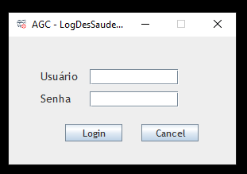

### **Tela de Cadastro de Usuário do Sistema**

Essa tela permite cadastrar um novo usuário no sistema. 

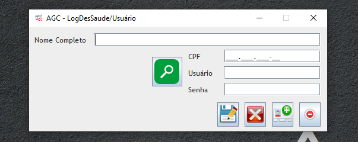

### **Home**

A tela principal do sistema exibe um menu com as opções disponíveis para o usuário. 
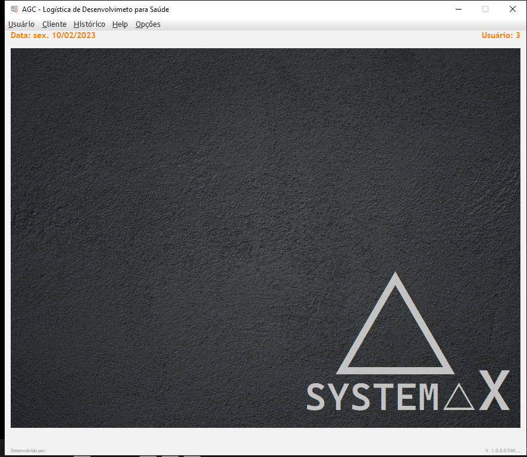

### **Inclusão de Usuário**

A tela de inclusão de usuário permite adicionar informações pessoais e de saúde de um novo usuário. 

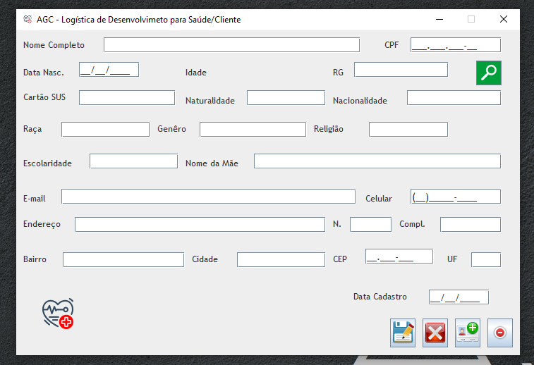

### **Inclusão de Informações de Saúde**

A tela de inclusão de informações de saúde permite adicionar registros relacionados ao histórico de saúde de um usuário. 

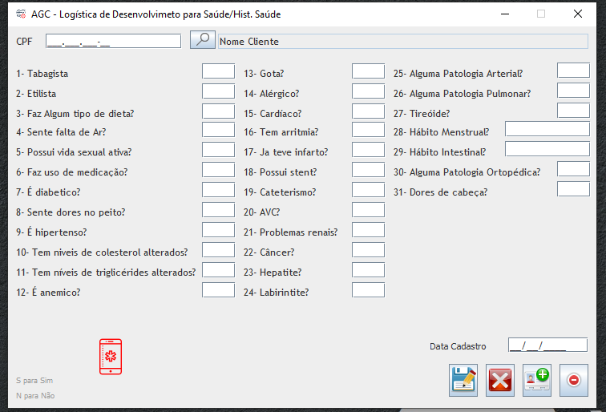

### **Inclusão de Informações de Saúde da Família**

A tela de inclusão de informações de saúde da família permite adicionar registros relacionados ao histórico de saúde de familiares de um usuário.

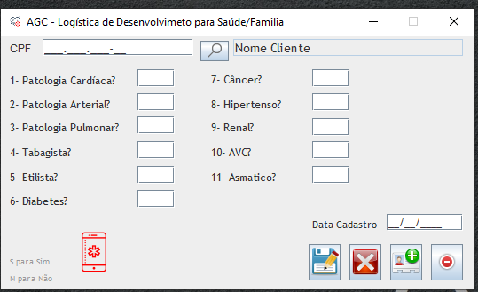

### **Inclusão de Informações de Saúde Psicológica**

A tela de inclusão de informações de saúde psicológica permite adicionar registros relacionados ao estado de saúde mental de um usuário. 

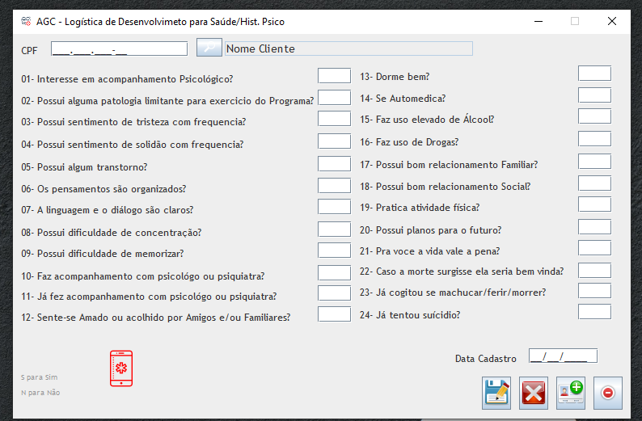

### **Inclusão de Informações de Saúde Psicológica Alto Risco**

A tela de inclusão de informações de saúde psicológica de alto risco permite adicionar registros relacionados ao estado de saúde mental de um usuário em situação de risco. 

### **Calculos**

A tela de cálculos exibe os resultados de cálculos específicos baseados nos registros da saúde física e dados antropométricos de um usuário.

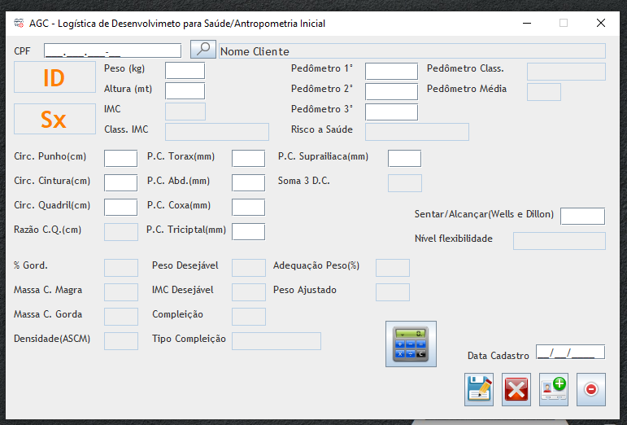

### **Sobre**

A tela de sobre exibe informações sobre o sistema e o desenvolvedor.

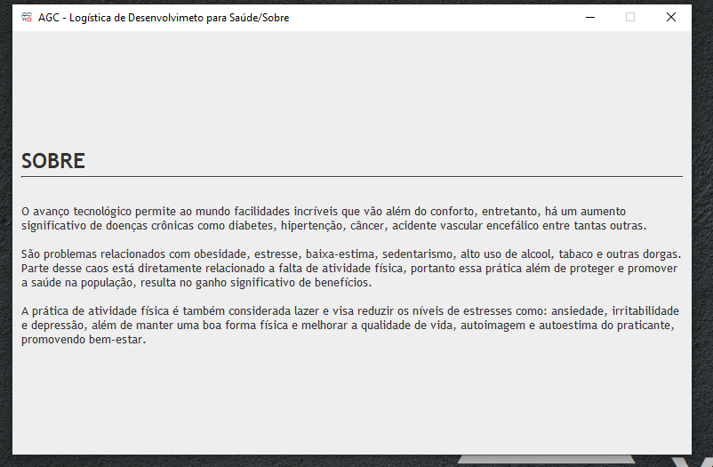

### **Sair**

A opção de sair encerra a sessão do usuário e fecha o sistema.

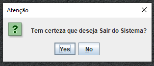

## 🧭 História do Projeto

Em 2014 tive a oportunidade de trabalhar em um projeto de pesquisa na área de saúde, que envolvia a coleta e análise de dados de saúde de usuários. A experiência me despertou o interesse em desenvolver um sistema que pudesse auxiliar na gestão de informações de saúde, promovendo a conscientização sobre hábitos saudáveis e a importância da atividade física. Na época eu nao tinha conhecimento em programação, mas sempre tive vontade de aprender, nesse sentido fiz um curso de Excel avançado e dei inicio ao levantamento dos dados e a criação de um sistema de gestão de informações de saúde. Se tratava de um sistema em excel, contava com diversas planilhas e gráficos, botões interativos, uso de macros, VBA, formulários, filtros, validações, etc. O sistema foi muito útil para a equipe de pesquisa, pois permitia a análise de dados de forma rápida e eficiente com base nas informações coletadas. O sistema foi utilizado por um período de 2 anos, e foi muito útil para a equipe de pesquisa, fornecendo insights valiosos sobre a saúde dos usuários.

Abaixo segue alguns insights extraídos da análise dos dados do sistema em Excel:
 
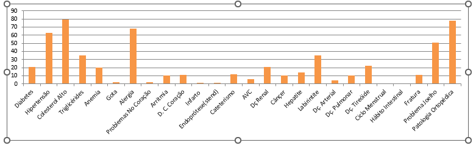

## 📚 Referências

- [JAVA](https://www.w3schools.com/java/java_ref_reference.asp)
- [Udemy](https://www.udemy.com/course/java-curso-completo/)
- [Eclipse](https://www.eclipse.org/)
- [MySQL](https://www.mysql.com/)
- [WindowBuilder](https://www.eclipse.org/windowbuilder/)
- [Swing](https://docs.oracle.com/javase/7/docs/api/javax/swing/package-summary.html)

## 👩‍💻 Autor

- *Andre Guilherme Correa* | [correandre8@gmail.com](mailto:correandre8@gmail.com)
